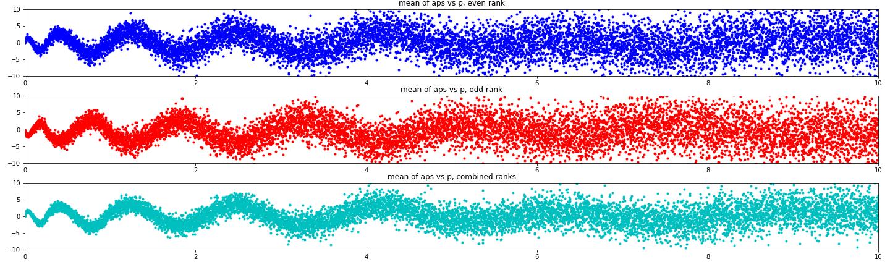
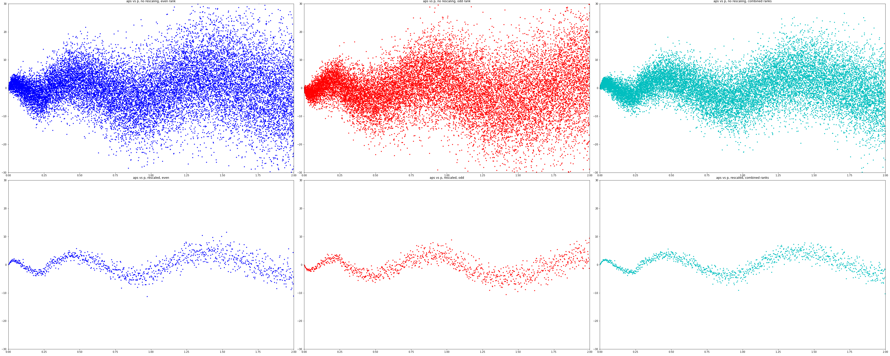
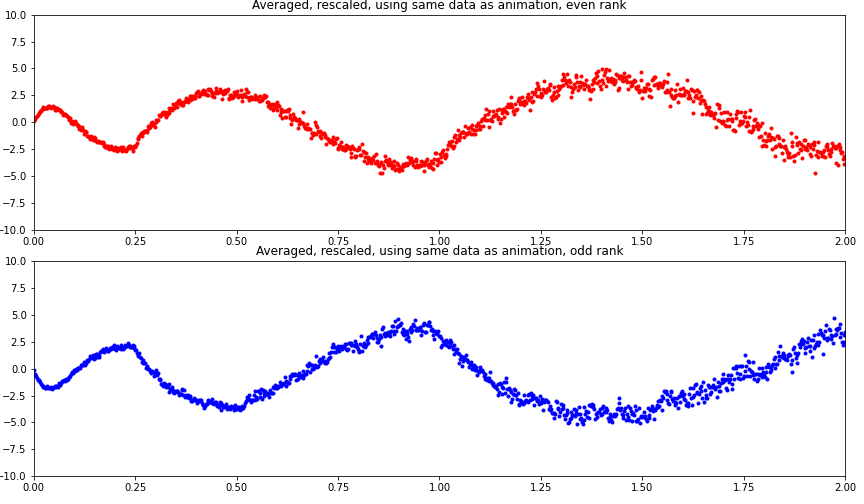

## Murmurations study

---------------------------

A collection of python notebooks investigating the murmuration phenomenon in elliptic curves.

### Description

---------------------------

The aim of this project is to help describe the recent phenomenon of murmurations in elliptic curves.
This project consists of simple Jupyter notebooks which will demonstrate the murmuration phenomenon in an easily reproducible manner.
I wish to thank the organizers and speakers of the murmurations conference held at ICERM [Murmurations Conference](https://icerm.brown.edu/events/htw-23-ma/).

### Installing
--------------
The data of the project is located at [google drive link to all-data.tar.gz](https://drive.google.com/file/d/1HV6sNle8l5t4diKn5p2mbR-xOTl-_p9l/view?usp=sharing).
I am using google drive to host the data files for these notebooks.
Please download the data file above (all-data.tar.gz) and extract into the data/ directory in the project.

Alternatively, you can load each notebook in google colaboratory.
If you do this, you can uncomment the relevant lines in order to run each notebook from google colab.

### Jupyter notebooks
---------------------
I provide several Jupyter notebooks which can be used to reproduce the phenomenon.

1. [Introduction](intro_murmurations.ipynb)
2. [Rescaling](scale_invariance.ipynb)
3. [Example - conductor ~ 100000](cond_100k_rescaled.ipynb)
4. [Example - conductor <= 50000](cond_50k_rescaled.ipynb)
5. [Example - CM curves](cm_curves_murmurations.ipynb)

Also included are two sets of scripts, and some sample datasets.
Let's now see some of the plots.

### Plots for $7500\leq N(E)\leq 10000$
---------------------------------------

")

### Plot for $N(E) \sim 100000$
-------------------------------
In this plot, we see that although the rescaling of the $x$-coordinates does not change the plot too much, the binning into intervals does smooth out the plot quite a bit (as you would expect). The plot below is of the mean of $a_p(E)$ where $N(E)\sim 100000$ and $p\leq 200000$, split according to the parity of the rank of $E$. To obtain the second row of plots, instead of plotting the mean of $a_p(E)$ over all $E$ with $N(E)\sim 100000$, we bin the $a_p(E)$ according to $p/N(E)$, take the averages of the bins and then plot the averages.

### Plots and videos for $N(E)\leq 50000$
------------------------------
We computed $a_p(E)$ for all $p\leq 50000$ and all elliptic curves with conductor $N(E)\leq 50000$ (obtained from the LMFDB).
At first, I split the curves into 14 distinct blocks of contiguous conductors and plot the mean of $a_p(E)$ vs $p$.
In the below animation, you can clearly see the scale invariance (in the $x$-coordinate) of the plots.

https://github.com/davidtweedle/elliptic-curve-data-science/assets/10039567/d36e2378-285c-4968-baa2-c9878c36853f

Later on, we bin the $a_p(E)$ according to $p/N(E)$ (taking advantage of the scale invariance) and then compute the means.
The result is the following two animations.
The first is the analogue to our first animation above.

https://github.com/davidtweedle/elliptic-curve-data-science/assets/10039567/ba963723-691d-4805-9756-f440cac27ba6

The second animation is a running average of each plot above. The plot converges very nicely and we can see that in the murmuration function is not smooth, and has a periodic flavour (but it is not periodic).

https://github.com/davidtweedle/elliptic-curve-data-science/assets/10039567/5e01e3db-fdbf-49bc-8f97-71e0941dc18c

### Python scripts

---------------------------

Three simple scripts to assist in displaying murmurations.
The following are contained in the murmur_from_dataframe.py in the directory pyscript.

1. bin_murmuration - for each $E,p$ in the dataset, bin $a_p(E)$ according to the value of $p/N(E)$ where $N$ is the conductor. This assumes that the data has already been split according to the parity of the rank of each elliptic curve.
2. display_murmuration - given a pandas dataframe containing $a_p(E)$ for each $E$, $p$ in our dataset, compute the mean of $\{a_p(E) \ |\ \mathrm{rank}(E)\equiv 0\bmod{2}\}$ and display a plot of the results as $y$ vs $x$-coordinate $p$. Then do the same for $\mathrm{rank}(E)\equiv1\bmod{2}$ and then $w(E)\cdot a_p(E)$ where $w(E)$ is $1$ if the rank of $E$ is even and $-1$ if the rank of $E$ is odd.
3. display_rescaled_murmuration - given the results of bin_murmuration, display the results in a similar way as display_murmuration.

### GP scripts

---------------------------

This is a summary of the scripts contained in the file generate-data.gp, contained in the directory gpscript.

1. write_aps - take a list of curves and labels (usually obtained from the LMFDB), and for each prime up to some fixed bound, write the following toa file: the label of E, the discriminant of E, the conductor of E, the rank of E, and $a_p(E)$ for each prime up to the fixed bound.
2. construct_box_curves - same as write_aps, but the list of curves comes from the curves of the form $y^2 = x^3 +Ax+B$ where $-A_0\leq A\leq A_0$ and $-B_0\leq B\leq B_0$
3. construct_twists_sqrt_n3 - same as write_aps, but the list of curves is $E_D: y^2 = x^3+D$. Notice that these curves have complex multiplication by the ring $\mathbb{Z}[(1+\sqrt{-3})/2]$.
4. construct_twists_sqrt_n1 - same as write_aps, but the list of curves is $E_D: y^2 = x^3+Dx$. Notice that these curves have complex multiplication by the ring $\mathbb{Z}[i]$
5. construct_twists_sqrt_N - same as write_aps, but the list of curves are the quadratic twists of a fixed curve with complex multiplication by the ring of integers in $\mathbb{Q}(\sqrt{N})$ where $N\in \{-2,-7,-11,-19,-43,-67,-163\}$
6. construct_all_twists - helper function for construct_twists_sqrt_N - used to construct all quadratic twists of a given curve
7. nth_power_free - determine if an integer is divisible by any nth-power
8. rescale_aps_sqrt_n1_step - construct all aps just as in construct_twists_sqrt_n1, but also complete the binning process
9. rescale_aps_sqrt_n1 - helper function for rescale_aps_sqrt_n1_step - the difference is that the above function splits the interval for $D$ into many subintervals and writes the results to separate files. The reason for this is to accomodate my own computing limits.

